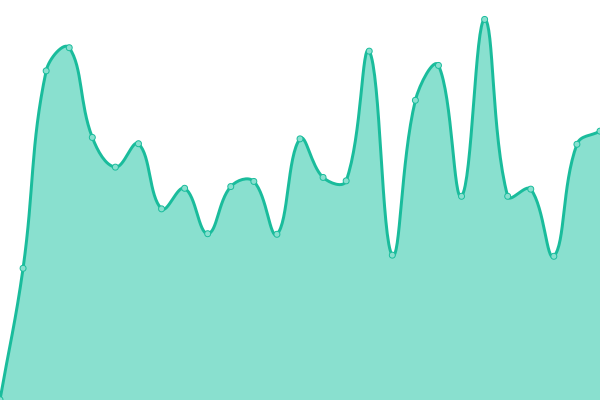

# [📈 Live Status](https://WeArePanda.github.io/Uptime): <!--live status--> **🟧 Partial outage**

This repository contains the open-source uptime monitor and status page for [WeArePanda](https://wearepanda.co.uk/), powered by [Upptime](https://github.com/upptime/upptime).

With [Upptime](https://upptime.js.org), you can get your own unlimited and free uptime monitor and status page, powered entirely by a GitHub repository. We use [Issues](https://github.com/WeArePanda/Uptime/issues) as incident reports, [Actions](https://github.com/WeArePanda/Uptime/actions) as uptime monitors, and [Pages](https://WeArePanda.github.io/Uptime) for the status page.

<!--start: status pages-->
<!-- This summary is generated by Upptime (https://github.com/upptime/upptime) -->
<!-- Do not edit this manually, your changes will be overwritten -->
<!-- prettier-ignore -->
| URL | Status | History | Response Time | Uptime |
| --- | ------ | ------- | ------------- | ------ |
|  [We are Panda](https://wearepanda.co.uk/) | 🟩 Up | [we-are-panda.yml](https://github.com/WeArePanda/Uptime/commits/HEAD/history/we-are-panda.yml) | 

 769ms
     
 | 

<a href="https://WeArePanda.github.io/Uptime/history/we-are-panda">97.64%</a>
    

|  [Bunkr](https://bunkr.co.uk/) | 🟩 Up | [bunkr.yml](https://github.com/WeArePanda/Uptime/commits/HEAD/history/bunkr.yml) | 

 823ms
     
 | 

<a href="https://WeArePanda.github.io/Uptime/history/bunkr">98.14%</a>
    

|  [Test Site](http://lpcic.co.uk/) | 🟥 Down | [test-site.yml](https://github.com/WeArePanda/Uptime/commits/HEAD/history/test-site.yml) | 

 0ms
     
 | 

<a href="https://WeArePanda.github.io/Uptime/history/test-site">0.00%</a>
    

<!--end: status pages-->

[**Visit our status website →**](https://WeArePanda.github.io/Uptime)

## 📄 License

- Powered by: [Upptime](https://github.com/upptime/upptime)
- Code: [MIT](./LICENSE) © [Anand Chowdhary](https://anandchowdhary.com), supported by [Pabio](https://pabio.com)
- Data in the `./history` directory: [Open Database License](https://opendatacommons.org/licenses/odbl/1-0/)
